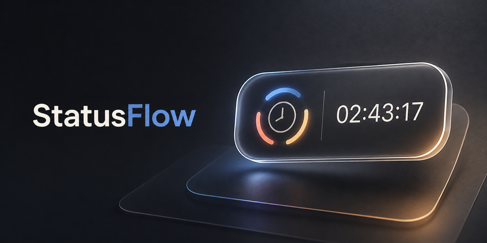

# StatusFlow



一款原生 macOS Menu Bar App，協助你切換「工作、休息、學習」狀態，掌握每天的時間分配。

## 重點功能

- 一鍵切換工作、休息與學習狀態
- 使用懸浮膠囊旁的按鈕快速切換狀態
- Menu Bar 即時顯示目前狀態與累計時間
- 查看今日統計與最近 7 天報告
- 可移動、永遠置頂的懸浮膠囊
- 自訂懸浮視窗的透明度與大小
- 紀錄只儲存在本機，重新開啟後接續計時

## 執行方式

1. 使用 macOS 14 或更新版本。
2. 安裝 Xcode 15 或更新版本。
3. 使用 Xcode 開啟 `Package.swift`。
4. Scheme 選擇 `StatusFlow`，執行目的地選擇 **My Mac**。
5. 按 `⌘R` 執行。

這是 Menu Bar App，啟動後不會出現在 Dock；請從畫面右上方選單列操作。

## 建立 DMG

執行打包腳本會建立支援 Apple Silicon 與 Intel Mac 的 `.app`，以及可拖入 Applications 的 `.dmg`：

```bash
./scripts/package-release.sh v0.0.1
```

產物位於 `dist/StatusFlow-v0.0.1.dmg`。

若要公開發佈並避免 Gatekeeper 警告，需使用 Apple Developer 的 Developer ID 憑證簽署與 Apple 公證（notarization）：

```bash
CODESIGN_IDENTITY="Developer ID Application: Your Name (TEAMID)" \
NOTARY_PROFILE="notary-profile" \
./scripts/package-release.sh v0.0.1
```

## 本機資料位置

`~/.StatusFlow/sessions.json`

程式會自動建立所需資料夾。若有舊版紀錄，首次啟動時會從下列位置尋找並搬移：

- `~/SideProject/StatusFlow/data/sessions.json`
- `~/Library/Application Support/StatusFlow/sessions.json`

找到後會自動讀取並寫入新位置。
